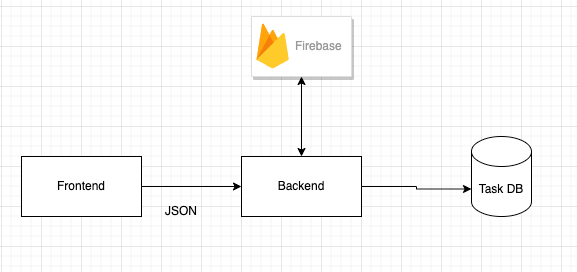
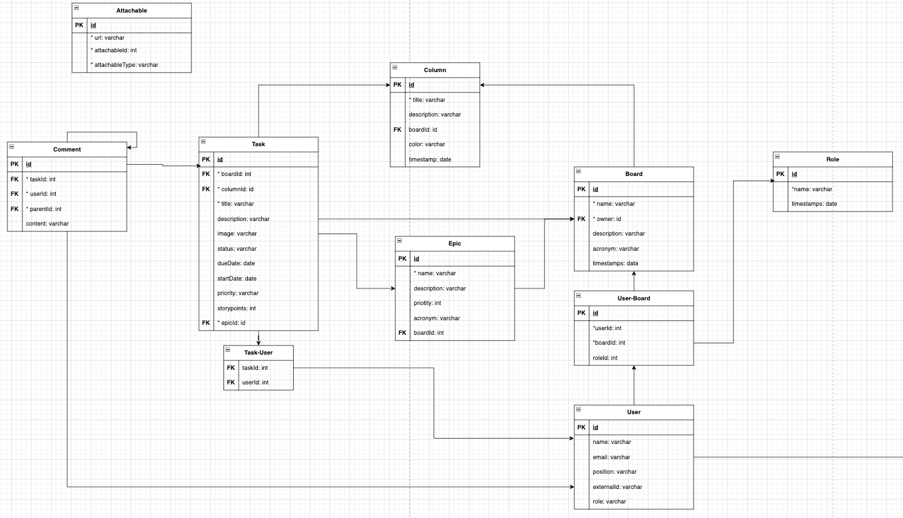

# Task-Manager
The purpose of this repository is to provide a mono-repo approach for developing web based a task manager.

## System Overview

The system will follow a classic client-server architecture using javascript based stacks

### Product UI Proposal

### Diagram

### Data Model

## Git Guidelines

### Commiting
- A commit should be created for each isolated change to the codebase. **Avoid having big commits with a lot of files changed**
- Follow these guidelines for commit descriptions: https://www.linkedin.com/pulse/7-best-practices-writing-good-git-commitmessages-kirinyet-brian/

### Branching
When creating new features a new branch should be created based on `main`

Creating a new branch (from `main`):
`git checkout -b <branchName>`

#### Naming

Naming conventions are simple and should be divided by purpose, the general ones are: 
- `feature`: For new functionality added to the project
- `fix`:  For fixing a bug of an unexpected functionality
- `chore`: For package update, documentation, comments, or maintenance purposes

example for working on a delete feature:
`git checkout -b feature/delete-task`

example for working on a bugfix:
`git checkout -b fix/correct-typo`

example for working on a maintenance issue:
`git checkout -b chore/update-package`

### Pull Requests

The way of adding code to the repository will be through pull request. A pull request should be created every new requirement.

